# Arquillian Event System

This document provides a comprehensive overview of the event sources and sinks in the Arquillian framework.

## Event Hierarchy

Arquillian uses an event-driven architecture with a hierarchical event structure:

### Core Events
- `Event` - Base interface for all events
  - `SuiteEvent` - Base for test suite lifecycle events
    - `ClassEvent` - Base for test class lifecycle events
      - `TestEvent` - Base for test method lifecycle events
        - `TestLifecycleEvent` - Base for test method lifecycle events with executor
          - `BeforeTestLifecycleEvent` - Events fired before test execution
          - `AfterTestLifecycleEvent` - Events fired after test execution
    - `ClassLifecycleEvent` - Base for class lifecycle events with executor

### Container Events
- `ContainerEvent` - Base for container lifecycle events
  - `DeployerEvent` - Base for deployment events
- `ContainerMultiControlEvent` - Interface for events that control multiple containers

### Event Hierarchy Diagram

```mermaid
classDiagram
    class Event {
        <<interface>>
    }
    
    class SuiteEvent {
        +SuiteEvent()
    }
    
    class ClassEvent {
        -TestClass testClass
        +ClassEvent(Class<?> testClass)
        +ClassEvent(TestClass testClass)
        +getTestClass() TestClass
    }
    
    class TestEvent {
        -Object testInstance
        -Method testMethod
        +TestEvent(Object testInstance, Method testMethod)
        +getTestInstance() Object
        +getTestMethod() Method
    }
    
    class TestLifecycleEvent {
        -LifecycleMethodExecutor executor
        +TestLifecycleEvent(Object testInstance, Method testMethod)
        +TestLifecycleEvent(Object testInstance, Method testMethod, LifecycleMethodExecutor executor)
        +getExecutor() LifecycleMethodExecutor
    }
    
    class BeforeTestLifecycleEvent {
        +BeforeTestLifecycleEvent(Object testInstance, Method testMethod)
        +BeforeTestLifecycleEvent(Object testInstance, Method testMethod, LifecycleMethodExecutor executor)
    }
    
    class AfterTestLifecycleEvent {
        +AfterTestLifecycleEvent(Object testInstance, Method testMethod)
        +AfterTestLifecycleEvent(Object testInstance, Method testMethod, LifecycleMethodExecutor executor)
    }
    
    class ClassLifecycleEvent {
        -LifecycleMethodExecutor executor
        +ClassLifecycleEvent(Class<?> testClass)
        +ClassLifecycleEvent(Class<?> testClass, LifecycleMethodExecutor executor)
        +getExecutor() LifecycleMethodExecutor
    }
    
    class ContainerEvent {
        -DeployableContainer deployableContainer
        +ContainerEvent(DeployableContainer deployableContainer)
        +getDeployableContainer() DeployableContainer
    }
    
    class DeployerEvent {
        -DeploymentDescription deployment
        +DeployerEvent(DeployableContainer deployableContainer, DeploymentDescription deployment)
        +getDeployment() DeploymentDescription
    }
    
    class ContainerMultiControlEvent {
        <<interface>>
    }
    
    class BeforeSuite {
        +BeforeSuite()
    }
    
    class AfterSuite {
        +AfterSuite()
    }
    
    class BeforeClass {
        +BeforeClass(Class<?> testClass)
        +BeforeClass(Class<?> testClass, LifecycleMethodExecutor executor)
    }
    
    class AfterClass {
        +AfterClass(Class<?> testClass)
        +AfterClass(Class<?> testClass, LifecycleMethodExecutor executor)
    }
    
    class Before {
        +Before(Object testInstance, Method testMethod)
        +Before(Object testInstance, Method testMethod, LifecycleMethodExecutor executor)
    }
    
    class After {
        +After(Object testInstance, Method testMethod)
        +After(Object testInstance, Method testMethod, LifecycleMethodExecutor executor)
    }
    
    class Test {
        -TestMethodExecutor testMethodExecutor
        +Test(TestMethodExecutor testMethodExecutor)
        +getTestMethodExecutor() TestMethodExecutor
    }
    
    class BeforeStart {
        +BeforeStart(DeployableContainer deployableContainer)
    }
    
    class AfterStart {
        +AfterStart(DeployableContainer deployableContainer)
    }
    
    class BeforeDeploy {
        +BeforeDeploy(DeployableContainer deployableContainer, DeploymentDescription deployment)
    }
    
    class AfterDeploy {
        +AfterDeploy(DeployableContainer deployableContainer, DeploymentDescription deployment)
    }
    
    Event <|-- SuiteEvent
    SuiteEvent <|-- ClassEvent
    ClassEvent <|-- TestEvent
    TestEvent <|-- TestLifecycleEvent
    TestLifecycleEvent <|-- BeforeTestLifecycleEvent
    TestLifecycleEvent <|-- AfterTestLifecycleEvent
    ClassEvent <|-- ClassLifecycleEvent
    
    Event <|-- ContainerEvent
    ContainerEvent <|-- DeployerEvent
    Event <|-- ContainerMultiControlEvent
    
    SuiteEvent <|-- BeforeSuite
    SuiteEvent <|-- AfterSuite
    ClassLifecycleEvent <|-- BeforeClass
    ClassLifecycleEvent <|-- AfterClass
    BeforeTestLifecycleEvent <|-- Before
    AfterTestLifecycleEvent <|-- After
    TestEvent <|-- Test
    
    ContainerEvent <|-- BeforeStart
    ContainerEvent <|-- AfterStart
    DeployerEvent <|-- BeforeDeploy
    DeployerEvent <|-- AfterDeploy
```

## Event Sources (Classes that fire events)

### Test Lifecycle Event Sources
- `EventTestRunnerAdaptor` - Fires suite, class, and test lifecycle events
  - Fires: `BeforeSuite`, `AfterSuite`, `BeforeClass`, `AfterClass`, `Before`, `After`, `Test`

### Container Lifecycle Event Sources
- `ContainerEventController` - Coordinates container lifecycle with test lifecycle
  - Fires: `SetupContainers`, `StartSuiteContainers`, `StopSuiteContainers`, `StartClassContainers`, `StopClassContainers`, `DeployManagedDeployments`, `UnDeployManagedDeployments`

- `ContainerImpl` - Implementation of container operations
  - Fires: `BeforeSetup`, `AfterSetup`, `BeforeStart`, `AfterStart`, `BeforeStop`, `AfterStop`, `BeforeKill`, `AfterKill`

- `ContainerLifecycleController` - Controls container lifecycle
  - Fires: `SetupContainer`, `StartContainer`, `StopContainer`

- `ContainerDeployController` - Controls deployment lifecycle
  - Fires: `DeployDeployment`, `UnDeployDeployment`, `BeforeDeploy`, `AfterDeploy`, `BeforeUnDeploy`, `AfterUnDeploy`

### Client-Side Event Sources
- `ClientContainerController` - Client-side container control
  - Fires: `StartContainer`, `DeployDeployment`, `SetupContainer`, `StopContainer`, `KillContainer`

- `ClientDeployer` - Client-side deployment control
  - Fires: `DeployDeployment`, `UnDeployDeployment`

- `ContainerRestarter` - Handles container restarts
  - Fires: `StopSuiteContainers`, `StartSuiteContainers`

### Execution Event Sources
- `ClientTestExecuter` - Executes tests on client side
  - Fires: `LocalExecutionEvent`, `RemoteExecutionEvent`

- `ContainerTestExecuter` - Executes tests in container
  - Fires: `LocalExecutionEvent`

- `RemoteTestExecuter` - Executes tests remotely
  - Fires events passed from client

## Event Sinks (Classes that observe events)

### Test Lifecycle Event Observers
- `TestInstanceEnricher` - Enriches test instances with resources
  - Observes: `Before`
  - Fires: `BeforeEnrichment`, `AfterEnrichment`

- `TestContextHandler` - Manages test context lifecycle
  - Observes: `SuiteEvent`, `ClassEvent`, `TestEvent`

### Container Lifecycle Event Observers
- `ContainerRegistryCreator` - Creates container registry
  - Observes: `ArquillianDescriptor`

- `ContainerLifecycleController` - Controls container lifecycle
  - Observes: `SetupContainers`, `StartSuiteContainers`, `StartClassContainers`, `StopSuiteContainers`, `StopClassContainers`, `StopManualContainers`, `SetupContainer`, `StartContainer`, `StopContainer`, `KillContainer`

- `ContainerDeployController` - Controls deployment lifecycle
  - Observes: `DeployManagedDeployments`, `UnDeployManagedDeployments`, `DeployDeployment`, `UnDeployDeployment`

- `DeploymentExceptionHandler` - Handles deployment exceptions
  - Observes: `DeployDeployment`

- `ArchiveDeploymentExporter` - Exports deployments for debugging
  - Observes: `BeforeDeploy`

### Client-Side Event Observers
- `ClientContainerControllerCreator` - Creates client-side container controller
  - Observes: `SetupContainers`

- `ContainerDeployerCreator` - Creates client-side deployer
  - Observes: `BeforeSuite`

- `ClientDeployerCreator` - Creates client-side deployer
  - Observes: `SetupContainers`

- `ContainerRestarter` - Handles container restarts
  - Observes: `BeforeClass`

### Execution Event Observers
- `ClientTestExecuter` - Executes tests on client side
  - Observes: `Test`

- `ContainerTestExecuter` - Executes tests in container
  - Observes: `Test`

- `LocalTestExecuter` - Executes tests locally
  - Observes: `LocalExecutionEvent`

- `RemoteTestExecuter` - Executes tests remotely
  - Observes: `RemoteExecutionEvent`

- `BeforeLifecycleEventExecuter` - Executes before lifecycle events
  - Observes: `BeforeTestLifecycleEvent`

- `AfterLifecycleEventExecuter` - Executes after lifecycle events
  - Observes: `AfterTestLifecycleEvent`

- `ClientBeforeAfterLifecycleEventExecuter` - Executes client-side lifecycle events
  - Observes: `BeforeClass`, `AfterClass`, `BeforeTestLifecycleEvent`, `AfterTestLifecycleEvent`

### Configuration Event Observers
- `ConfigurationRegistrar` - Loads and registers configuration
  - Observes: `ManagerStarted`

- `ProtocolRegistryCreator` - Creates protocol registry
  - Observes: `ArquillianDescriptor`

### Command Event Observers
- `ContainerCommandObserver` - Handles container commands
  - Observes: `StartContainerCommand`, `StopContainerCommand`, `KillContainerCommand`, `ContainerStartedCommand`

- `DeploymentCommandObserver` - Handles deployment commands
  - Observes: `DeployDeploymentCommand`, `UnDeployDeploymentCommand`, `GetDeploymentCommand`

- `RemoteResourceCommandObserver` - Handles resource commands
  - Observes: `RemoteResourceCommand`

## Event Flow

### Test Suite Lifecycle
1. `BeforeSuite` event is fired
   - `ContainerEventController` observes and fires `SetupContainers` and `StartSuiteContainers`
   - `ContainerLifecycleController` observes and sets up/starts suite containers

2. `AfterSuite` event is fired
   - `ContainerEventController` observes and fires `StopSuiteContainers`
   - `ContainerLifecycleController` observes and stops suite containers

### Test Class Lifecycle
1. `BeforeClass` event is fired
   - `ContainerEventController` observes and fires `StartClassContainers`, `GenerateDeployment`, and `DeployManagedDeployments`
   - `ContainerLifecycleController` observes and starts class containers
   - `DeploymentGenerator` observes `GenerateDeployment` and generates deployments
   - `ContainerDeployController` observes `DeployManagedDeployments` and deploys managed deployments

2. `AfterClass` event is fired
   - `ContainerEventController` observes and fires `UnDeployManagedDeployments`, `StopManualContainers`, and `StopClassContainers`
   - `ContainerDeployController` observes `UnDeployManagedDeployments` and undeploys managed deployments
   - `ContainerLifecycleController` observes and stops class containers

### Test Method Lifecycle
1. `Before` event is fired
   - `TestInstanceEnricher` observes and enriches test instance

2. `Test` event is fired
   - `ClientTestExecuter` or `ContainerTestExecuter` observes and executes test

3. `After` event is fired
   - Cleanup operations are performed

## Key Event Patterns

### Observer Pattern
Arquillian uses the observer pattern extensively through the `@Observes` annotation to decouple event producers from event consumers.

### Event Context
Many events are wrapped in an `EventContext` to allow for interception and modification of the event flow.

### Event Hierarchy
Events are organized in a hierarchy to allow for different levels of granularity in observation.

### Event Precedence
Observers can specify a precedence value to control the order of execution.