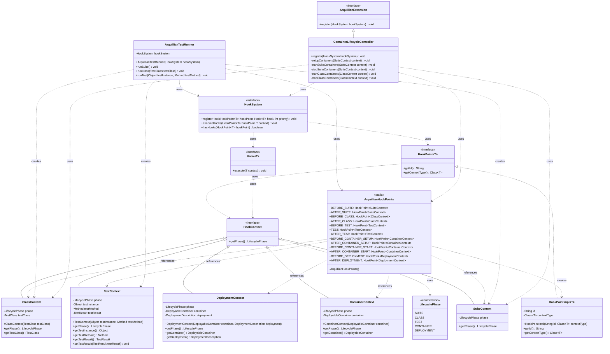

# Arquillian SPI Proposal: Lifecycle Hook System

This document proposes a Service Provider Interface (SPI) design that could replace the current event-driven architecture in Arquillian with a more direct and explicit hook-based system.

## Current Challenges with Event-Based Architecture

While the event-driven architecture in Arquillian provides flexibility and loose coupling, it also has some drawbacks:

1. **Implicit Flow**: The event flow is implicit, making it difficult to understand the execution path without deep knowledge of the codebase.
2. **Debugging Complexity**: Debugging event-based systems can be challenging as the flow of control jumps between components.
3. **Performance Overhead**: Event dispatch has some performance overhead, especially with many observers.
4. **Discoverability**: It's not immediately clear which events are available to observe or which components observe them.
5. **Order Dependencies**: Managing execution order through precedence can be error-prone.

## Proposed SPI: Lifecycle Hook System

The proposed SPI would replace the event system with a more explicit hook-based system that maintains extensibility while providing clearer control flow.

### Core Concepts

1. **Lifecycle Phases**: Well-defined phases in the test execution lifecycle
2. **Hook Points**: Specific points within phases where extensions can register callbacks
3. **Hook Registry**: Central registry for managing hook registrations
4. **Priority System**: Explicit ordering of hook execution
5. **Context Objects**: Shared state passed between hooks

### Class Diagram



### Key Interfaces

```java
/**
 * Main interface for the hook system
 */
public interface HookSystem {
    /**
     * Register a hook to be executed at a specific hook point
     */
    <T extends HookContext> void registerHook(HookPoint<T> hookPoint, Hook<T> hook, int priority);
    
    /**
     * Execute all hooks registered for a specific hook point
     */
    <T extends HookContext> void executeHooks(HookPoint<T> hookPoint, T context);
    
    /**
     * Check if any hooks are registered for a specific hook point
     */
    <T extends HookContext> boolean hasHooks(HookPoint<T> hookPoint);
}

/**
 * Represents a specific point in the lifecycle where extensions can hook in
 */
public interface HookPoint<T extends HookContext> {
    /**
     * Get the unique identifier for this hook point
     */
    String getId();
    
    /**
     * Get the context class for this hook point
     */
    Class<T> getContextType();
}

/**
 * A hook that can be executed at a specific hook point
 */
public interface Hook<T extends HookContext> {
    /**
     * Execute the hook with the provided context
     */
    void execute(T context) throws Exception;
}

/**
 * Base interface for context objects passed to hooks
 */
public interface HookContext {
    /**
     * Get the current phase of execution
     */
    LifecyclePhase getPhase();
}
```

### Predefined Hook Points

The SPI would define standard hook points that correspond to the current event system:

```java
public final class ArquillianHookPoints {
    // Suite lifecycle
    public static final HookPoint<SuiteContext> BEFORE_SUITE = new HookPointImpl<>("beforeSuite", SuiteContext.class);
    public static final HookPoint<SuiteContext> AFTER_SUITE = new HookPointImpl<>("afterSuite", SuiteContext.class);
    
    // Class lifecycle
    public static final HookPoint<ClassContext> BEFORE_CLASS = new HookPointImpl<>("beforeClass", ClassContext.class);
    public static final HookPoint<ClassContext> AFTER_CLASS = new HookPointImpl<>("afterClass", ClassContext.class);
    
    // Test lifecycle
    public static final HookPoint<TestContext> BEFORE_TEST = new HookPointImpl<>("beforeTest", TestContext.class);
    public static final HookPoint<TestContext> TEST = new HookPointImpl<>("test", TestContext.class);
    public static final HookPoint<TestContext> AFTER_TEST = new HookPointImpl<>("afterTest", TestContext.class);
    
    // Container lifecycle
    public static final HookPoint<ContainerContext> BEFORE_CONTAINER_SETUP = new HookPointImpl<>("beforeContainerSetup", ContainerContext.class);
    public static final HookPoint<ContainerContext> AFTER_CONTAINER_SETUP = new HookPointImpl<>("afterContainerSetup", ContainerContext.class);
    public static final HookPoint<ContainerContext> BEFORE_CONTAINER_START = new HookPointImpl<>("beforeContainerStart", ContainerContext.class);
    public static final HookPoint<ContainerContext> AFTER_CONTAINER_START = new HookPointImpl<>("afterContainerStart", ContainerContext.class);
    
    // Deployment lifecycle
    public static final HookPoint<DeploymentContext> BEFORE_DEPLOYMENT = new HookPointImpl<>("beforeDeployment", DeploymentContext.class);
    public static final HookPoint<DeploymentContext> AFTER_DEPLOYMENT = new HookPointImpl<>("afterDeployment", DeploymentContext.class);
    
    // Private constructor to prevent instantiation
    private ArquillianHookPoints() {}
}
```

### Context Objects

Context objects would provide access to relevant state and functionality:

```java
public class SuiteContext implements HookContext {
    private final LifecyclePhase phase = LifecyclePhase.SUITE;
    
    @Override
    public LifecyclePhase getPhase() {
        return phase;
    }
}

public class ClassContext implements HookContext {
    private final LifecyclePhase phase = LifecyclePhase.CLASS;
    private final TestClass testClass;
    
    public ClassContext(TestClass testClass) {
        this.testClass = testClass;
    }
    
    @Override
    public LifecyclePhase getPhase() {
        return phase;
    }
    
    public TestClass getTestClass() {
        return testClass;
    }
}

public class TestContext implements HookContext {
    private final LifecyclePhase phase = LifecyclePhase.TEST;
    private final Object testInstance;
    private final Method testMethod;
    private TestResult testResult;
    
    public TestContext(Object testInstance, Method testMethod) {
        this.testInstance = testInstance;
        this.testMethod = testMethod;
    }
    
    @Override
    public LifecyclePhase getPhase() {
        return phase;
    }
    
    public Object getTestInstance() {
        return testInstance;
    }
    
    public Method getTestMethod() {
        return testMethod;
    }
    
    public TestResult getTestResult() {
        return testResult;
    }
    
    public void setTestResult(TestResult testResult) {
        this.testResult = testResult;
    }
}

public class ContainerContext implements HookContext {
    private final LifecyclePhase phase = LifecyclePhase.CONTAINER;
    private final DeployableContainer<?> container;
    
    public ContainerContext(DeployableContainer<?> container) {
        this.container = container;
    }
    
    @Override
    public LifecyclePhase getPhase() {
        return phase;
    }
    
    public DeployableContainer<?> getContainer() {
        return container;
    }
}

public class DeploymentContext implements HookContext {
    private final LifecyclePhase phase = LifecyclePhase.DEPLOYMENT;
    private final DeployableContainer<?> container;
    private final DeploymentDescription deployment;
    
    public DeploymentContext(DeployableContainer<?> container, DeploymentDescription deployment) {
        this.container = container;
        this.deployment = deployment;
    }
    
    @Override
    public LifecyclePhase getPhase() {
        return phase;
    }
    
    public DeployableContainer<?> getContainer() {
        return container;
    }
    
    public DeploymentDescription getDeployment() {
        return deployment;
    }
}
```

### Extension Registration

Extensions would register hooks through a service provider mechanism:

```java
public interface ArquillianExtension {
    /**
     * Register hooks with the hook system
     */
    void register(HookSystem hookSystem);
}
```

Extensions would be discovered using the ServiceLoader mechanism:

```java
ServiceLoader<ArquillianExtension> extensions = ServiceLoader.load(ArquillianExtension.class);
for (ArquillianExtension extension : extensions) {
    extension.register(hookSystem);
}
```

### Example Usage

Here's how the container lifecycle controller might be implemented using the hook system:

```java
public class ContainerLifecycleController implements ArquillianExtension {
    @Override
    public void register(HookSystem hookSystem) {
        // Register hooks for container lifecycle
        hookSystem.registerHook(ArquillianHookPoints.BEFORE_SUITE, this::setupContainers, 100);
        hookSystem.registerHook(ArquillianHookPoints.BEFORE_SUITE, this::startSuiteContainers, 90);
        hookSystem.registerHook(ArquillianHookPoints.AFTER_SUITE, this::stopSuiteContainers, 100);
        
        hookSystem.registerHook(ArquillianHookPoints.BEFORE_CLASS, this::startClassContainers, 100);
        hookSystem.registerHook(ArquillianHookPoints.AFTER_CLASS, this::stopClassContainers, 100);
    }
    
    private void setupContainers(SuiteContext context) {
        // Setup containers
    }
    
    private void startSuiteContainers(SuiteContext context) {
        // Start suite containers
    }
    
    private void stopSuiteContainers(SuiteContext context) {
        // Stop suite containers
    }
    
    private void startClassContainers(ClassContext context) {
        // Start class containers
    }
    
    private void stopClassContainers(ClassContext context) {
        // Stop class containers
    }
}
```

And here's how the test runner would execute the hooks:

```java
public class ArquillianTestRunner {
    private final HookSystem hookSystem;
    
    public ArquillianTestRunner(HookSystem hookSystem) {
        this.hookSystem = hookSystem;
    }
    
    public void runSuite() {
        SuiteContext context = new SuiteContext();
        
        try {
            // Execute before suite hooks
            hookSystem.executeHooks(ArquillianHookPoints.BEFORE_SUITE, context);
            
            // Run test classes
            
        } finally {
            // Execute after suite hooks
            hookSystem.executeHooks(ArquillianHookPoints.AFTER_SUITE, context);
        }
    }
    
    public void runClass(TestClass testClass) {
        ClassContext context = new ClassContext(testClass);
        
        try {
            // Execute before class hooks
            hookSystem.executeHooks(ArquillianHookPoints.BEFORE_CLASS, context);
            
            // Run test methods
            
        } finally {
            // Execute after class hooks
            hookSystem.executeHooks(ArquillianHookPoints.AFTER_CLASS, context);
        }
    }
    
    public void runTest(Object testInstance, Method testMethod) {
        TestContext context = new TestContext(testInstance, testMethod);
        
        try {
            // Execute before test hooks
            hookSystem.executeHooks(ArquillianHookPoints.BEFORE_TEST, context);
            
            // Execute test hooks
            hookSystem.executeHooks(ArquillianHookPoints.TEST, context);
            
        } finally {
            // Execute after test hooks
            hookSystem.executeHooks(ArquillianHookPoints.AFTER_TEST, context);
        }
    }
}
```

## Benefits of the Hook System

1. **Explicit Flow**: The flow of execution is more explicit and easier to follow.
2. **Improved Debugging**: Debugging is simpler as the control flow is more direct.
3. **Better Performance**: Direct method calls can be more efficient than event dispatch.
4. **Enhanced Discoverability**: Predefined hook points make it clear where extensions can integrate.
5. **Explicit Ordering**: Priority system makes execution order more explicit.
6. **Type Safety**: Context objects provide type-safe access to relevant state.
7. **Simplified Extension Model**: Extensions register hooks directly rather than observing events.

## Migration Strategy

To migrate from the event system to the hook system:

1. **Parallel Implementation**: Implement the hook system alongside the event system.
2. **Bridge Layer**: Create a bridge that translates events to hook calls and vice versa.
3. **Gradual Migration**: Migrate components one by one from events to hooks.
4. **Deprecation**: Deprecate the event system once all components have been migrated.
5. **Removal**: Remove the event system in a future major version.

## Conclusion

The proposed hook-based SPI would provide a more explicit and direct way for extensions to integrate with Arquillian while maintaining the flexibility and extensibility of the current event-based system. It would improve code clarity, debugging, and performance while providing a clearer extension model.