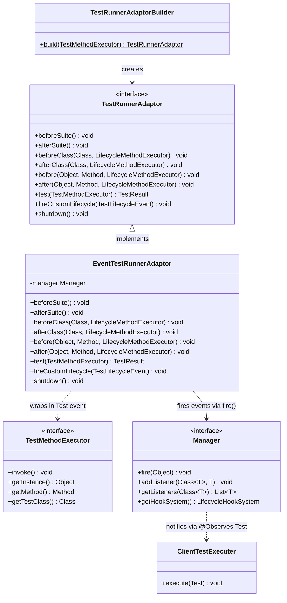
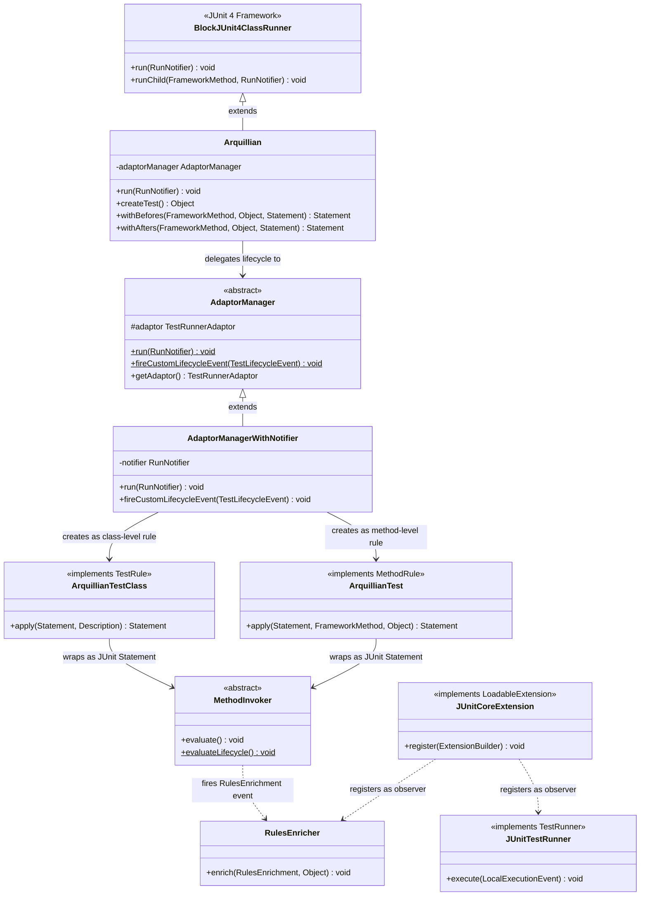
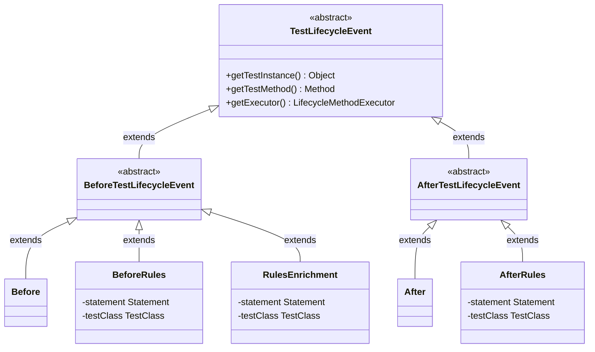
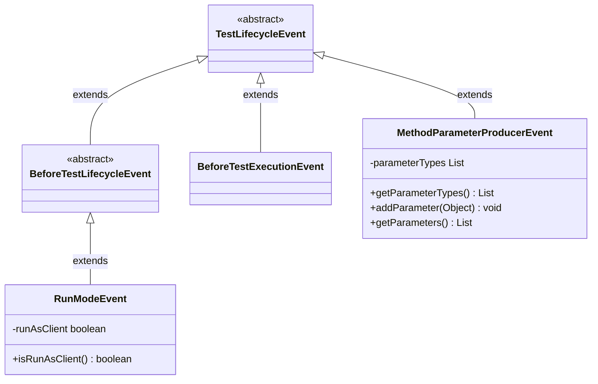
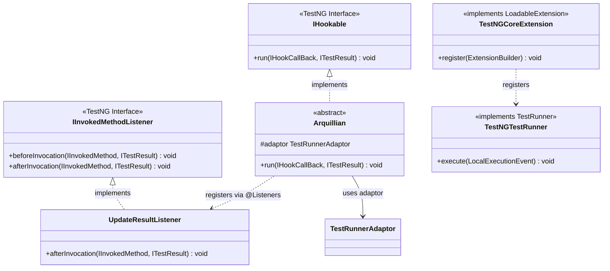
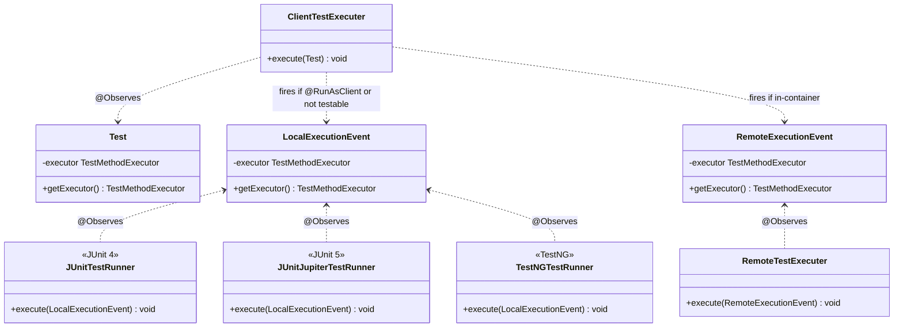
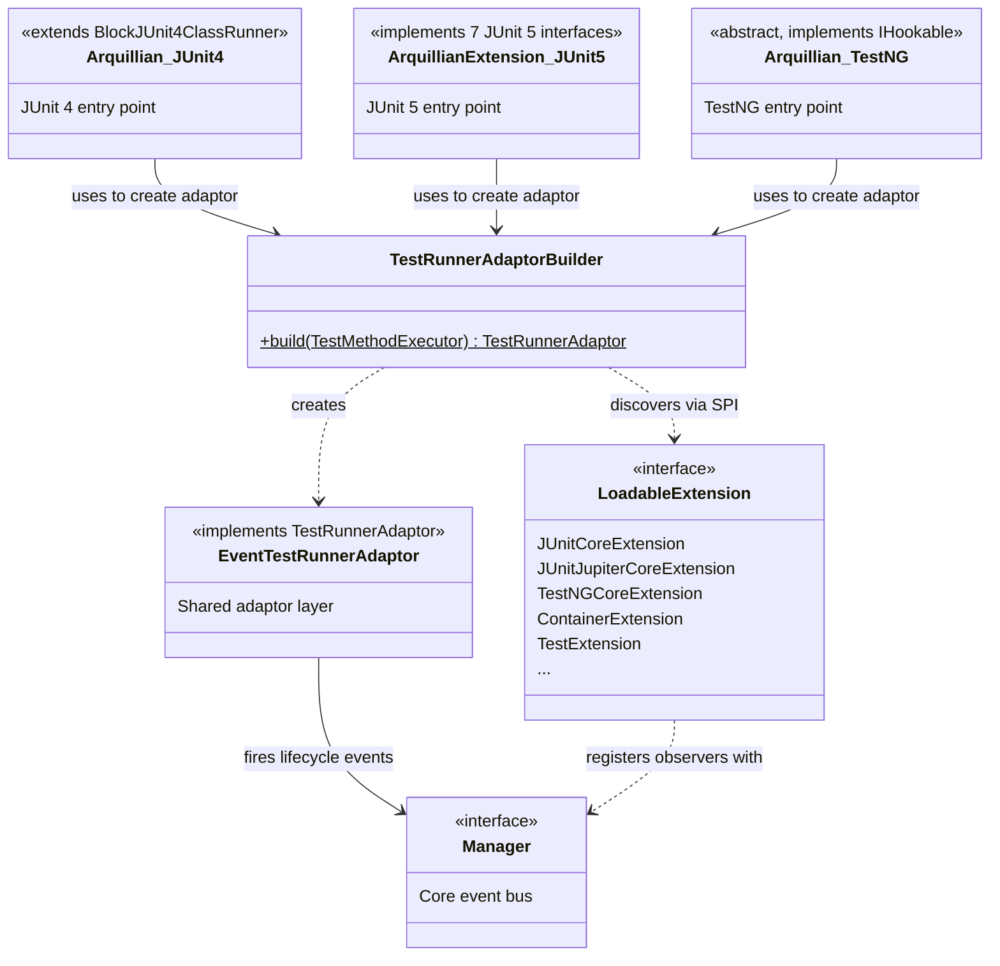

# Test Framework Integration — Class Diagrams

This document shows how JUnit 4, JUnit 5 (Jupiter), and TestNG each integrate with Arquillian
using Mermaid class diagrams. All three frameworks share a common adaptor layer
(`TestRunnerAdaptor` / `EventTestRunnerAdaptor`) and differ only in the entry-point glue code.

---

## 1. Shared Infrastructure

All three frameworks delegate to the same `EventTestRunnerAdaptor`, which translates lifecycle
calls into `Manager#fire()` events. The `Manager` event bus then dispatches to all registered
`@Observes` observers.

**Key point:** `TestRunnerAdaptorBuilder` uses `LoadableExtensionLoader` to discover and load
all `LoadableExtension` SPI implementations before returning the configured adaptor.

---

## 2. JUnit 4 Integration

### 2a. Runner and Lifecycle Delegation

### 2b. JUnit 4 Custom Lifecycle Events

JUnit 4 fires several custom event types that extend the standard lifecycle hierarchy. These
events are dispatched via `Manager#fire()` and reach `@Observes` observers, but are **not**
visible to the `TestLifecycleListener` SPI (which observes only exact concrete types like
`Before`/`After`).

---

## 3. JUnit 5 (Jupiter) Integration

### 3a. Extension and Lifecycle Manager

JUnit 5 uses the `Extension` SPI rather than a custom runner. `ArquillianExtension` is
registered via `@ExtendWith(ArquillianExtension.class)` and implements seven JUnit 5 extension
interfaces.

```mermaid
classDiagram
    class BeforeAllCallback {
        <<JUnit 5 Interface>>
        +beforeAll(ExtensionContext) void
    }

    class AfterAllCallback {
        <<JUnit 5 Interface>>
        +afterAll(ExtensionContext) void
    }

    class BeforeEachCallback {
        <<JUnit 5 Interface>>
        +beforeEach(ExtensionContext) void
    }

    class AfterEachCallback {
        <<JUnit 5 Interface>>
        +afterEach(ExtensionContext) void
    }

    class BeforeTestExecutionCallback {
        <<JUnit 5 Interface>>
        +beforeTestExecution(ExtensionContext) void
    }

    class InvocationInterceptor {
        <<JUnit 5 Interface>>
        +interceptTestMethod(Invocation, ReflectiveInvocationContext, ExtensionContext) void
    }

    class ParameterResolver {
        <<JUnit 5 Interface>>
        +supportsParameter(ParameterContext, ExtensionContext) boolean
        +resolveParameter(ParameterContext, ExtensionContext) Object
    }

    class ArquillianExtension {
        +beforeAll(ExtensionContext) void
        +afterAll(ExtensionContext) void
        +beforeEach(ExtensionContext) void
        +afterEach(ExtensionContext) void
        +beforeTestExecution(ExtensionContext) void
        +interceptTestMethod(Invocation, ReflectiveInvocationContext, ExtensionContext) void
        +supportsParameter(ParameterContext, ExtensionContext) boolean
        +resolveParameter(ParameterContext, ExtensionContext) Object
    }

    class JUnitJupiterTestClassLifecycleManager {
        <<implements AutoCloseable>>
        <<implements CloseableResource>>
        -adaptor TestRunnerAdaptor
        +beforeAll(Class) void
        +afterAll() void
        +beforeEach(Object, Method) void
        +afterEach(Object, Method) void
        +close() void
    }

    class MethodParameterObserver {
        +on(MethodParameterProducerEvent) void
    }

    class RunModeEventHandler {
        +on(RunModeEvent) void
    }

    class JUnitJupiterCoreExtension {
        <<implements LoadableExtension>>
        +register(ExtensionBuilder) void
    }

    class JUnitJupiterTestRunner {
        <<implements TestRunner>>
        +execute(LocalExecutionEvent) void
    }

    BeforeAllCallback <|.. ArquillianExtension : implements
    AfterAllCallback <|.. ArquillianExtension : implements
    BeforeEachCallback <|.. ArquillianExtension : implements
    AfterEachCallback <|.. ArquillianExtension : implements
    BeforeTestExecutionCallback <|.. ArquillianExtension : implements
    InvocationInterceptor <|.. ArquillianExtension : implements
    ParameterResolver <|.. ArquillianExtension : implements

    ArquillianExtension --> JUnitJupiterTestClassLifecycleManager : stores in ExtensionContext.Store
    JUnitJupiterTestClassLifecycleManager --> TestRunnerAdaptor : uses
    JUnitJupiterCoreExtension ..> MethodParameterObserver : registers
    JUnitJupiterCoreExtension ..> RunModeEventHandler : registers
    JUnitJupiterCoreExtension ..> JUnitJupiterTestRunner : registers
```

### 3b. JUnit 5 Custom Lifecycle Events

JUnit 5 introduces additional events beyond the standard `Before`/`After`. Like the JUnit 4
custom events, these reach `@Observes` observers but are invisible to the `TestLifecycleListener`
SPI.

---

## 4. TestNG Integration

TestNG uses a base class (`Arquillian`) rather than a runner or extension. Tests extend this
class, which implements `IHookable` so TestNG delegates test method invocation through it. An
`IInvokedMethodListener` (`UpdateResultListener`) is registered via `@Listeners` to capture test
outcomes.

---

## 5. Client vs. In-Container Execution

All three framework runners eventually fire a `Test` event into the `Manager`. `ClientTestExecuter`
observes `Test` and decides whether to run locally (client-side) or remotely (in-container).

**Decision logic in `ClientTestExecuter`:**
- If the deployment is marked `testable=false`, or the test method is annotated `@RunAsClient`,
  fire `LocalExecutionEvent` (runs on the client JVM without going to the container).
- Otherwise fire `RemoteExecutionEvent`, which the protocol layer (Servlet or JMX) forwards to
  the in-container side for execution.

---

## 6. Complete Integration Overview

