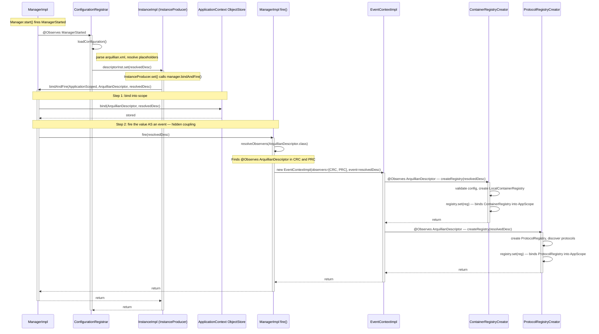
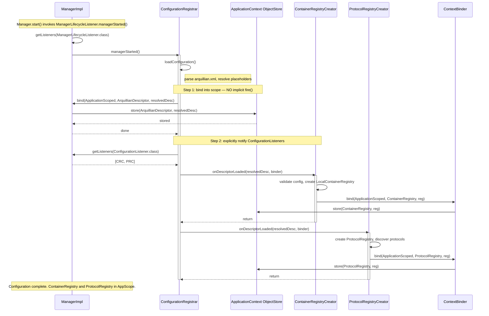

# bindAndFire Replacement: ArquillianDescriptor Configuration Flow

This document shows how the implicit `bindAndFire` event chain for `ArquillianDescriptor`
works today, and how it would be replaced with explicit `ConfigurationListener` dispatch.

---

## Current Flow: Implicit bindAndFire Chain

The `ArquillianDescriptor` reaches `ContainerRegistryCreator` and `ProtocolRegistryCreator`
through a hidden coupling between the DI system and the event bus. `InstanceProducer.set()`
internally calls `manager.bindAndFire()`, which both stores the value in the scoped context
AND fires it as an event on the bus.



### Problems with Current Flow

1. **Hidden coupling**: `InstanceProducer.set()` implicitly fires the value as an event — callers don't know this happens
2. **Untraceable**: Debugger shows `set()` → `bindAndFire()` → `fire()` → observer dispatch — indirect and surprising
3. **Fragile**: If `bindAndFire` is removed or the event bus is deprecated, `ContainerRegistryCreator` silently stops being invoked
4. **Testing**: No unit test verifies the `set()` → `fire()` → `@Observes` chain; tests mock around it

---

## Proposed Flow: Explicit ConfigurationListener Dispatch

Replace the implicit `fire(resolvedDesc)` with an explicit loop over registered
`ConfigurationListener` instances. The `InstanceProducer.set()` only binds into scope —
it no longer fires. The `ConfigurationRegistrar` itself is responsible for notifying listeners.



### Key Changes

| Aspect | Current (bindAndFire) | Proposed (ConfigurationListener) |
|---|---|---|
| **Trigger** | `InstanceProducer.set()` implicitly fires event | `ConfigurationRegistrar` explicitly calls listeners |
| **Dispatch** | Event bus resolves `@Observes ArquillianDescriptor` | `manager.getListeners(ConfigurationListener.class)` |
| **Scope binding** | `bindAndFire()` does both bind + fire | `manager.bind()` for storage; listener call for notification |
| **Discoverability** | Must know that `set()` fires an event | Listener interface is explicit in the call chain |
| **Debuggability** | Stack trace goes through `fire()` → `EventContextImpl` → reflection | Direct method call: `listener.onDescriptorLoaded()` |
| **Dependency resolution** | Listeners use `@Inject Instance<T>` | Listeners receive `ContextBinder` parameter |
| **Ordering** | `@Observes` precedence (implicit) | Registration order or explicit priority parameter |

### ContextBinder Interface

```java
public interface ContextBinder {
    <T> void bind(Class<? extends Annotation> scope, Class<T> type, T instance);
    <T> T resolve(Class<T> type);
}
```

The `ContextBinder` replaces `@Inject @ApplicationScoped InstanceProducer<T>` — listeners
receive it as a parameter and use it to bind values into scoped contexts without needing
DI-managed fields.

### ConfigurationListener Interface

```java
public interface ConfigurationListener {
    default void onDescriptorLoaded(ArquillianDescriptor descriptor,
                                    ContextBinder binder) throws Exception {}
}
```

### ManagerImpl.bindAndFire() Deprecation Path

```java
// Current
public <T> void bindAndFire(Class<? extends Annotation> scope, Class<T> type, T instance) {
    bind(scope, type, instance);
    fire(instance);  // <-- this is the hidden coupling
}

// Transitional: add bind-only method, keep bindAndFire for backward compat
public <T> void bind(Class<? extends Annotation> scope, Class<T> type, T instance) {
    // store into scoped context only, no event firing
}

// InstanceProducer.set() changes from bindAndFire() to bind()
// Only after all @Observes-on-produced-value patterns are migrated to listeners
```

### What Must Change in InstanceImpl

```java
// Current (InstanceImpl.java:62-67)
@Override
public void set(T value) {
    if (scope == null) {
        throw new IllegalStateException("...");
    }
    manager.bindAndFire(scope, type, value);  // fires event
}

// Proposed
@Override
public void set(T value) {
    if (scope == null) {
        throw new IllegalStateException("...");
    }
    manager.bind(scope, type, value);  // bind only, no fire
}
```

**Warning**: This change breaks any code that depends on `set()` firing an event.
Every `@Observes SomeType` where `SomeType` is a value produced via `InstanceProducer.set()`
must be migrated to an explicit listener BEFORE `InstanceImpl` is changed.

### Affected bindAndFire Patterns

The following `InstanceProducer.set()` calls currently trigger implicit event dispatch
that downstream `@Observes` handlers depend on:

| Producer | Value Type | Downstream Observer(s) |
|---|---|---|
| `ConfigurationRegistrar.descriptorInst.set()` | `ArquillianDescriptor` | `ContainerRegistryCreator`, `ProtocolRegistryCreator` |

All other `InstanceProducer.set()` calls (e.g., `ContainerRegistryCreator.registry.set()`)
bind values that are consumed via `@Inject Instance<T>.get()` — not via `@Observes`.
The `ArquillianDescriptor` is the **only** value type where `set()` triggers observer dispatch
that downstream code depends on.
