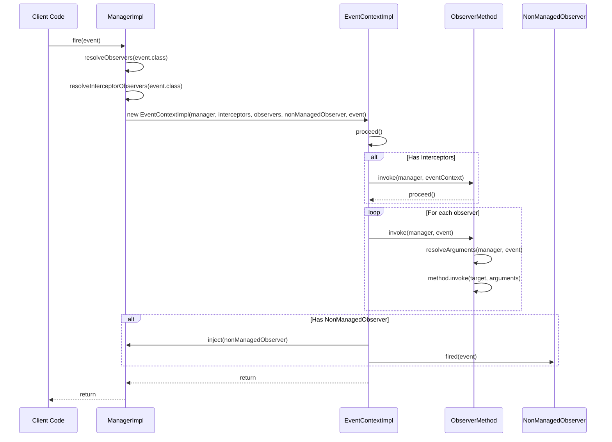
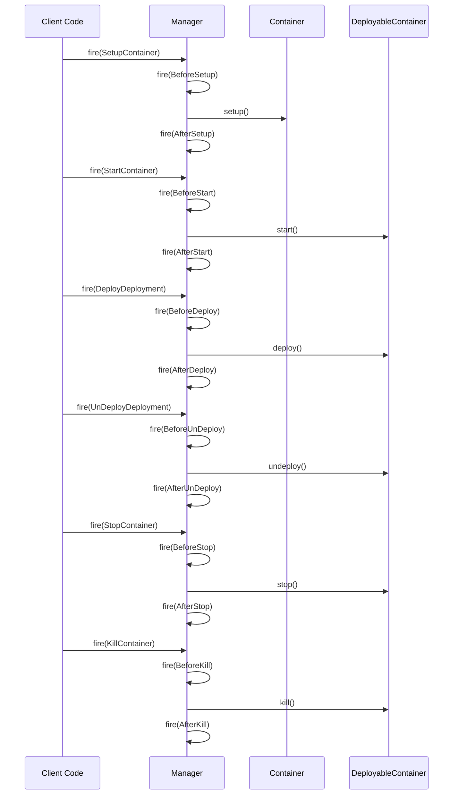
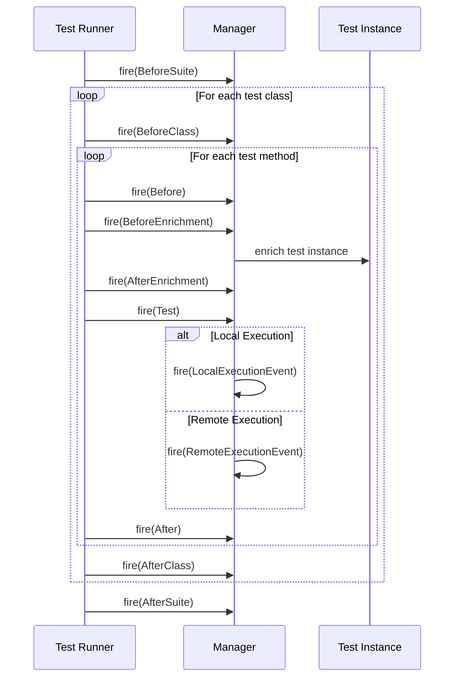
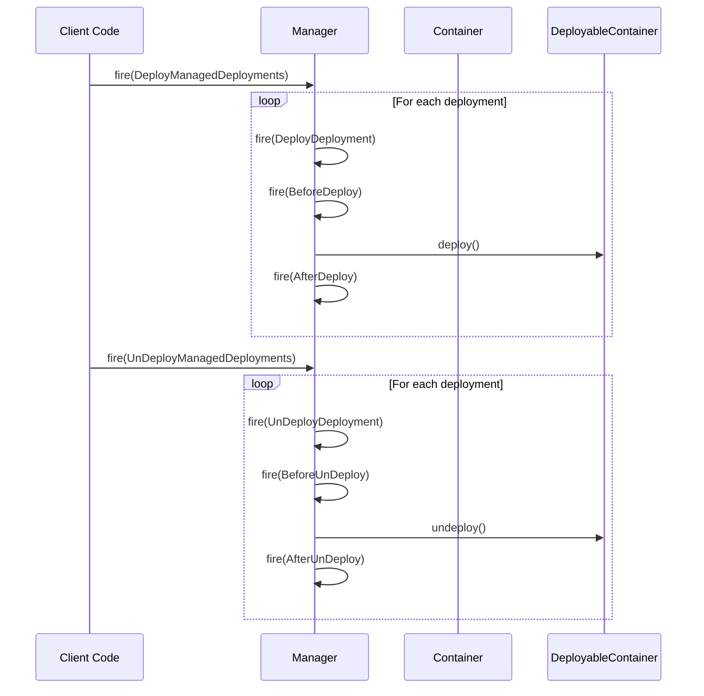
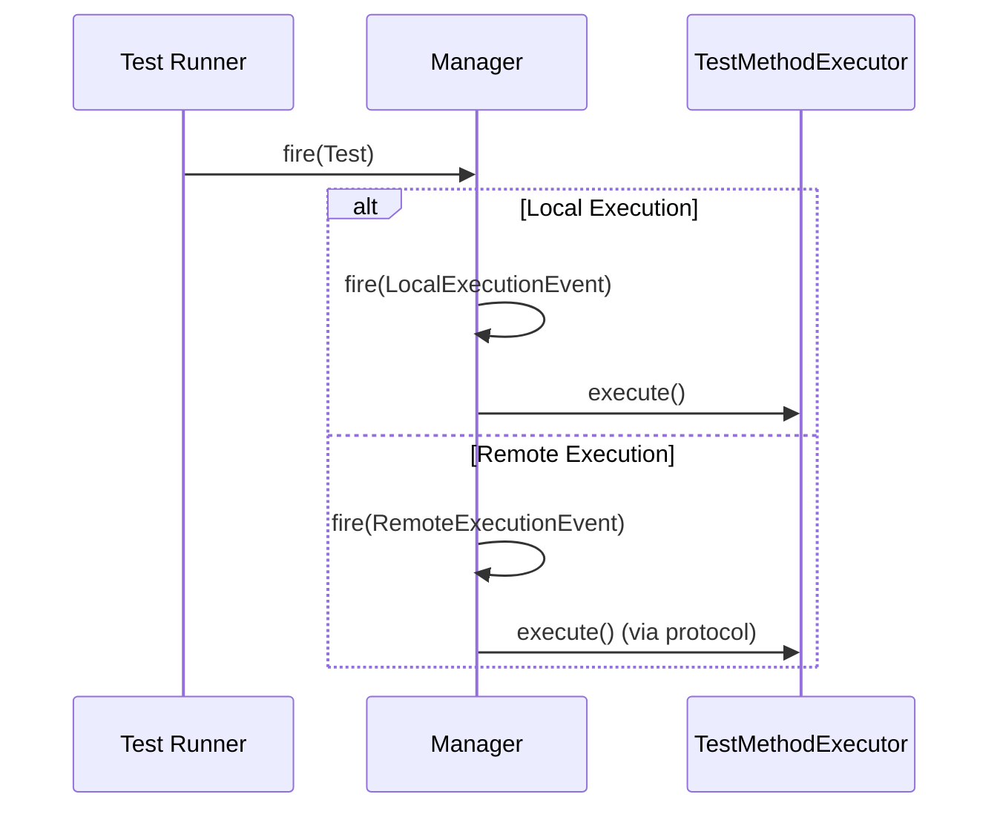

# Arquillian Event Sequence Diagrams

This document contains sequence diagrams for the various event flows in the Arquillian framework.

## Core Event Flow

The core event system in Arquillian is based on an observer pattern where events are fired by the `Manager` and processed by observers. Here's the sequence diagram for the core event flow:

This diagram shows how events are processed in Arquillian:

1. A client fires an event through the Manager
2. The Manager resolves all observers and interceptors for the event type
3. An EventContext is created to handle the event processing
4. If there are interceptors, they are invoked first
5. Then all observers are invoked with the event
6. Finally, if there's a non-managed observer, it's injected and notified
7. Control returns to the client

## Container Lifecycle Events

Container lifecycle events represent the lifecycle of a container in Arquillian. Here's the sequence diagram:

This diagram shows the container lifecycle events:

1. Container setup: SetupContainer → BeforeSetup → Container.setup() → AfterSetup
2. Container start: StartContainer → BeforeStart → DeployableContainer.start() → AfterStart
3. Deployment: DeployDeployment → BeforeDeploy → DeployableContainer.deploy() → AfterDeploy
4. Undeployment: UnDeployDeployment → BeforeUnDeploy → DeployableContainer.undeploy() → AfterUnDeploy
5. Container stop: StopContainer → BeforeStop → DeployableContainer.stop() → AfterStop
6. Container kill: KillContainer → BeforeKill → DeployableContainer.kill() → AfterKill

## Test Lifecycle Events

Test lifecycle events represent the execution of tests in Arquillian. Here's the sequence diagram:

This diagram shows the test lifecycle events:

1. Suite lifecycle: BeforeSuite → (test execution) → AfterSuite
2. Class lifecycle: BeforeClass → (test methods execution) → AfterClass
3. Test method lifecycle: Before → BeforeEnrichment → AfterEnrichment → Test → (LocalExecutionEvent or RemoteExecutionEvent) → After

## Deployment Events

Deployment events represent the deployment of artifacts to containers. Here's the sequence diagram:

This diagram shows the deployment events:

1. Managed deployments: DeployManagedDeployments → (for each deployment) → DeployDeployment → BeforeDeploy → deploy() → AfterDeploy
2. Managed undeployments: UnDeployManagedDeployments → (for each deployment) → UnDeployDeployment → BeforeUnDeploy → undeploy() → AfterUnDeploy

## Execution Events

Execution events represent the execution of test methods. Here's the sequence diagram:

This diagram shows the execution events:

1. Local execution: Test → LocalExecutionEvent → execute()
2. Remote execution: Test → RemoteExecutionEvent → execute() (via protocol)